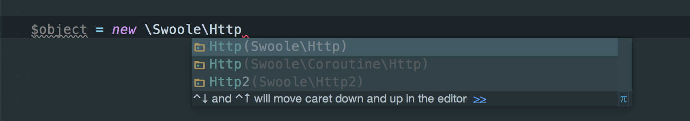
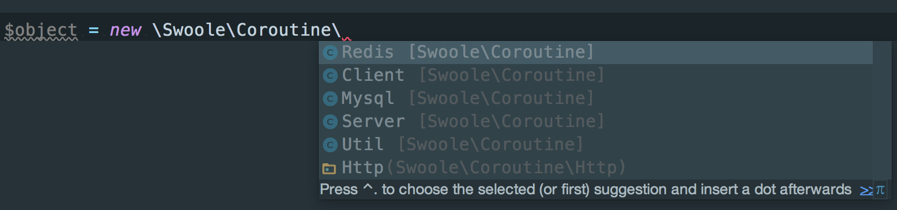
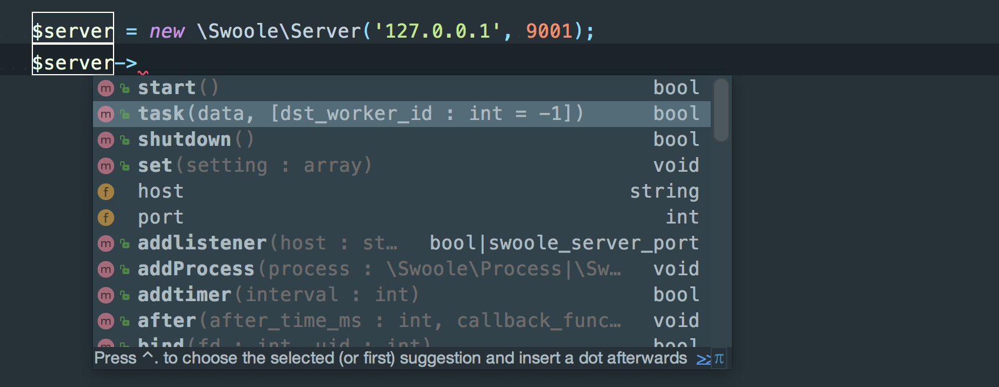
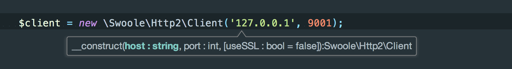

Swoole Auto Complete
====================

Auto completion, trigger suggest and view docs for [Swoole](https://github.com/swoole/swoole-src) in editor.

The purpose of avoid the tips of undefined and improve work efficiency.

## Usage
### Composer (recommended)：

    composer require --dev "eaglewu/swoole-ide-helper:dev-master"

### Text editor：

Put the source code in your project.

### IDE

Put the source code path into `Include Path` in IDE.

### Demo screenshots：

### Have fun :)
