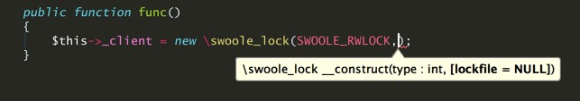
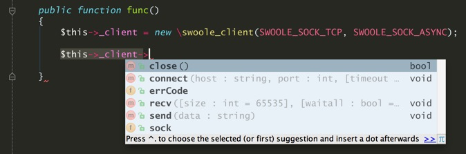

swoole-auto-complete
====================

[Swoole](https://github.com/matyhtf/swoole) 在IDE下自动识别类、函数、宏，自动补全函数名

Swoole 结构，便于开发过程中查看文档，以及屏蔽IDE undefined 提示，便于快速查看函数用法。

Swoole releases 版本下载地址：[https://github.com/swoole/swoole-src/releases](https://github.com/swoole/swoole-src/releases)

API 手册在线预览：[Swoole API Manual](https://docs.phper.io/swoole/swoole-api-manual/docs/)

### 使用方式
 
普通IDE：

开发Swoole项目同时，在IDE中打开/导入本文件即可。

使用 IDE自带 ``Include Path`` 功能引入 helper 目录

PHPstorm使用演示(其他IDE同理)：

  

  

  

  

使用php.jar包

  

